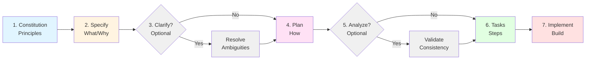
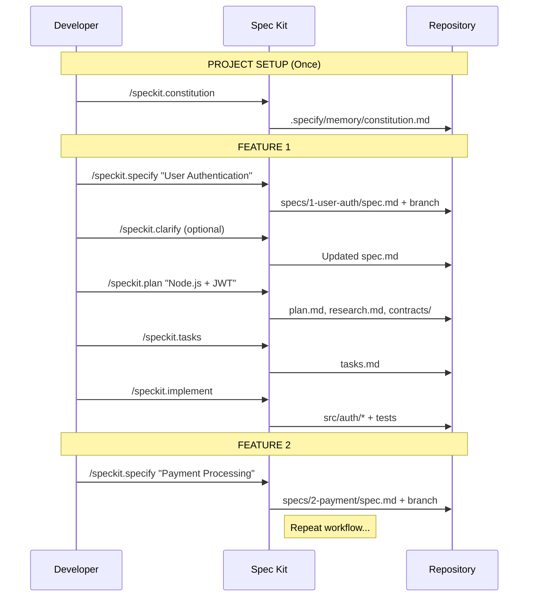
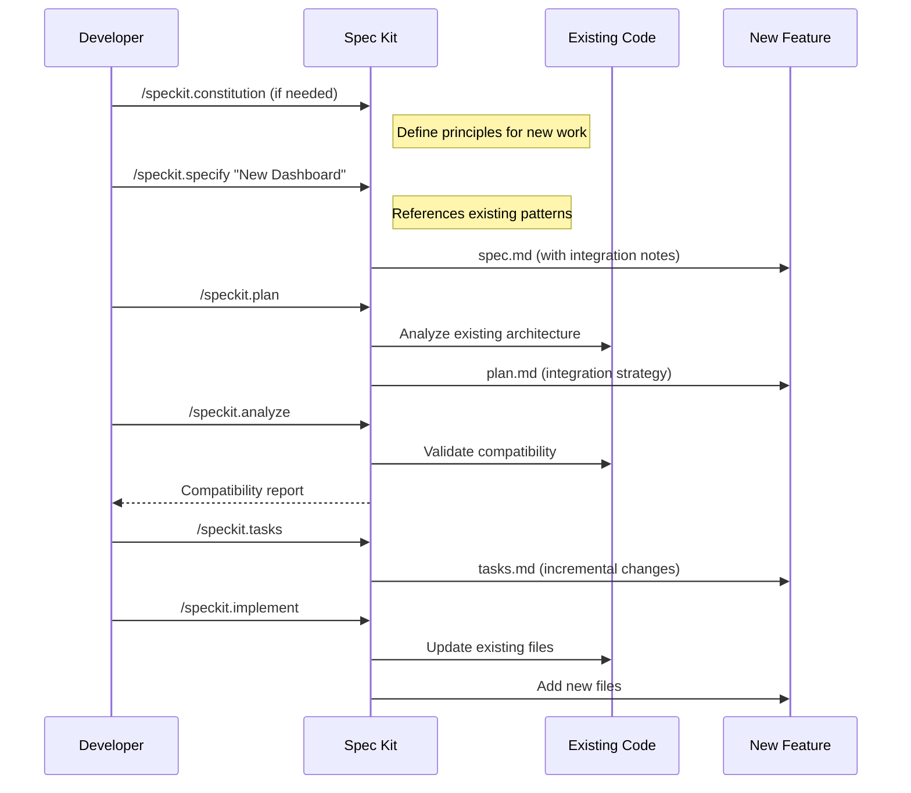
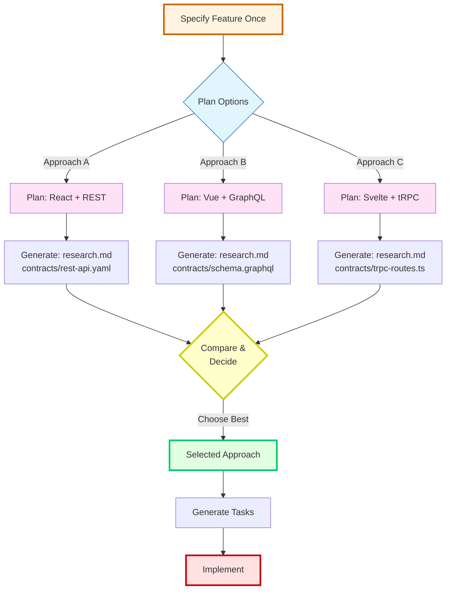
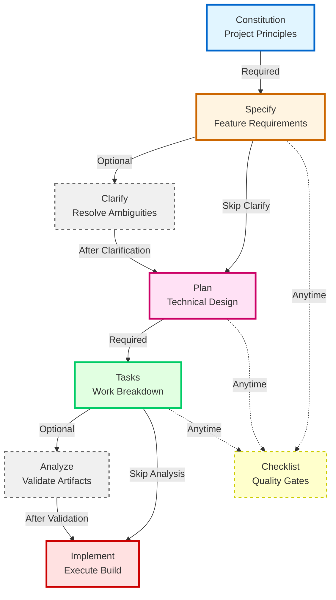
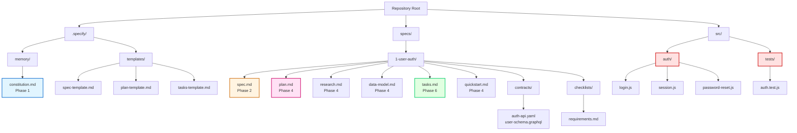

# Spec Kit Workflow Guide

Comprehensive guide to Spec-Driven Development using Spec Kit skills in this repository.

## What is Spec-Driven Development?

Spec-Driven Development flips traditional software development by starting with **executable specifications** instead of jumping straight to code. It emphasizes:

- **Intent-driven development** - Define requirements before implementation
- **Multi-step refinement** - Structured progression from idea to implementation
- **Technology independence** - Works with any language or framework
- **AI-assisted execution** - Specifications guide AI coding assistants

## Core Workflow Sequence

The canonical Spec Kit workflow follows these phases in order:



### Phase-by-Phase Breakdown

| Phase | Command                 | Purpose                                  | Output Files                                                         | Required        |
| ----- | ----------------------- | ---------------------------------------- | -------------------------------------------------------------------- | --------------- |
| 1     | `/speckit.constitution` | Define project principles and governance | `.specify/memory/constitution.md`                                    | First time only |
| 2     | `/speckit.specify`      | Capture feature requirements             | `specs/N-name/spec.md`, branch `N-name`                              | Yes             |
| 3     | `/speckit.clarify`      | Resolve specification ambiguities        | Updated `spec.md`                                                    | Optional        |
| 4     | `/speckit.plan`         | Create technical implementation strategy | `specs/N-name/plan.md`, `research.md`, `data-model.md`, `contracts/` | Yes             |
| 5     | `/speckit.analyze`      | Validate cross-artifact consistency      | Analysis report                                                      | Optional        |
| 6     | `/speckit.tasks`        | Break work into actionable units         | `specs/N-name/tasks.md`                                              | Yes             |
| 7     | `/speckit.implement`    | Execute all tasks to build feature       | Implementation code/files                                            | Yes             |

### Additional Commands

| Command                  | Purpose                               | When to Use                    |
| ------------------------ | ------------------------------------- | ------------------------------ |
| `/speckit.checklist`     | Generate custom validation checklists | Quality assurance at any phase |
| `/speckit.taskstoissues` | Convert tasks to GitHub issues        | Project management integration |

## Detailed Phase Guide

### Phase 1: Establish Principles (`/speckit.constitution`)

**When**: Project initialization or when updating governance rules.

**What it does**:

- Creates versioned project constitution with core principles
- Defines non-negotiable rules (test-first, library architecture, etc.)
- Establishes governance and amendment procedures
- Syncs dependent templates with new principles

**Key points**:

- Run once per project (update as needed with semantic versioning)
- Influences all subsequent specs and plans
- Use MAJOR.MINOR.PATCH versioning for constitution changes

**Example input**:

```
/speckit.constitution

Our project follows:
1. Test-first development (non-negotiable)
2. Library-first architecture (standalone, independently testable)
3. CLI interfaces for all functionality
4. Observability through structured logging
```

**Output**: `.specify/memory/constitution.md` with versioned principles

---

### Phase 2: Specify Requirements (`/speckit.specify`)

**When**: Starting a new feature or enhancement.

**What it does**:

- Creates feature branch (e.g., `1-user-auth`)
- Generates structured spec from natural language description
- Defines user stories with priorities (P1, P2, P3)
- Documents acceptance criteria and success metrics
- Identifies assumptions and constraints
- Creates quality validation checklist

**Key points**:

- Focus on **WHAT** and **WHY**, not HOW
- Written for business stakeholders, not developers
- No tech stack, APIs, or implementation details
- Maximum 3 `[NEEDS CLARIFICATION]` markers
- Success criteria must be measurable and technology-agnostic

**Example input**:

```
/speckit.specify Add user authentication with email/password login, password reset, and session management
```

**Output**:

- Branch: `1-user-auth`
- `specs/1-user-auth/spec.md`
- `specs/1-user-auth/checklists/requirements.md`

---

### Phase 3: Clarify Ambiguities (`/speckit.clarify`) [Optional]

**When**: After specify, when specification has unresolved questions.

**What it does**:

- Identifies underspecified areas in the spec
- Asks up to 5 targeted clarification questions
- Updates spec with user's answers
- Removes `[NEEDS CLARIFICATION]` markers

**Key points**:

- Optional but recommended if spec has ambiguities
- Interactive question-answer flow
- Ensures spec completeness before planning

**Example interaction**:

```
/speckit.clarify

Agent asks:
Q1: Should password reset links expire? [Yes - 24h / Yes - 1h / No expiration]
Q2: Maximum login attempts before lockout? [3 attempts / 5 attempts / No limit]

User responds:
Q1: Yes - 1h
Q2: 5 attempts
```

**Output**: Updated `specs/N-name/spec.md` with clarifications

---

### Phase 4: Plan Implementation (`/speckit.plan`)

**When**: After specification is complete and clear.

**What it does**:

- Creates technical implementation strategy
- Chooses tech stack and architecture
- Defines data models and API contracts
- Validates against constitution principles
- Generates research on unknowns
- Updates agent context with new technologies

**Key points**:

- First phase where HOW is addressed
- Constitution compliance is validated
- Research resolves technical unknowns
- Creates contracts (OpenAPI, GraphQL schemas)

**Example input**:

```
/speckit.plan I'm building with Node.js, Express, PostgreSQL, and JWT for auth
```

**Output**:

- `specs/N-name/plan.md`
- `specs/N-name/research.md`
- `specs/N-name/data-model.md`
- `specs/N-name/contracts/*.yaml` or `*.graphql`
- `specs/N-name/quickstart.md`
- Updated agent context files

---

### Phase 5: Validate Consistency (`/speckit.analyze`) [Optional]

**When**: After tasks are generated, before implementation.

**What it does**:

- Cross-checks spec, plan, and tasks for consistency
- Identifies gaps or contradictions
- Validates completeness and quality
- Provides analysis report

**Key points**:

- Quality assurance checkpoint
- Non-destructive (read-only analysis)
- Catches issues before coding begins

**Example input**:

```
/speckit.analyze
```

**Output**: Analysis report highlighting issues or confirming readiness

---

### Phase 6: Generate Tasks (`/speckit.tasks`)

**When**: After planning is complete.

**What it does**:

- Breaks plan into dependency-ordered tasks
- Creates actionable work items with clear descriptions
- Identifies task dependencies and prerequisites
- Categorizes tasks by type (setup, feature, test, docs)

**Key points**:

- Tasks are ordered by dependencies
- Each task is independently actionable
- Clear acceptance criteria per task

**Example input**:

```
/speckit.tasks
```

**Output**: `specs/N-name/tasks.md` with ordered task list

---

### Phase 7: Execute Implementation (`/speckit.implement`)

**When**: After all planning artifacts are ready.

**What it does**:

- Reads spec, plan, and tasks
- Executes each task in dependency order
- Writes code, tests, and documentation
- Validates against acceptance criteria
- Runs tests and builds

**Key points**:

- Final execution phase
- Follows all prior guidance and constraints
- Validates implementation against spec

**Example input**:

```
/speckit.implement
```

**Output**: Fully implemented feature with code, tests, docs

---

## Workflow Scenarios

### Greenfield Development (0-to-1)

**Scenario**: Building a new project from scratch.



**Key characteristic**: Start with constitution, build incrementally feature-by-feature.

---

### Brownfield Enhancement (Adding to Existing Code)

**Scenario**: Adding new features to an existing codebase.



**Key characteristic**: Plan considers existing architecture and integration points.

---

### Creative Exploration (Parallel Approaches)

**Scenario**: Testing multiple technical approaches for the same feature.



**Key characteristic**: Same spec, multiple plans, comparative evaluation.

---

## Command Chaining & Dependencies

Commands build on each other sequentially:



**Critical dependencies**:

- Constitution must exist before first specify
- Specify must complete before plan
- Plan must complete before tasks
- Tasks must complete before implement
- Clarify can run after specify, before plan
- Analyze can run after tasks, before implement
- Checklist can run at any phase for quality validation

## File Structure After Full Workflow



**Text view**:

```
.specify/
├── memory/
│   └── constitution.md           # Project principles (Phase 1)
└── templates/
    ├── spec-template.md
    ├── plan-template.md
    └── tasks-template.md

specs/
└── 1-user-auth/                  # Feature directory
    ├── spec.md                   # Requirements (Phase 2)
    ├── plan.md                   # Technical plan (Phase 4)
    ├── research.md               # Technical research (Phase 4)
    ├── data-model.md             # Entity definitions (Phase 4)
    ├── tasks.md                  # Work breakdown (Phase 6)
    ├── quickstart.md             # Implementation guide (Phase 4)
    ├── contracts/                # API schemas (Phase 4)
    │   ├── auth-api.yaml
    │   └── user-schema.graphql
    └── checklists/               # Quality validation
        └── requirements.md       # Spec validation (Phase 2)

src/                              # Implementation (Phase 7)
├── auth/
│   ├── login.js
│   ├── session.js
│   └── password-reset.js
└── tests/
    └── auth.test.js
```

## Best Practices

### Do's

- **Follow the sequence**: Each phase builds on the previous
- **Constitution first**: Establish principles before first feature
- **Clarify early**: Resolve ambiguities before planning
- **Validate often**: Use analyze and checklist commands
- **Document assumptions**: Make informed guesses, note them in spec
- **Prioritize stories**: Use P1/P2/P3 for user stories (most critical first)
- **Keep specs technology-agnostic**: No implementation details in spec.md

### Don'ts

- **Don't skip specify**: Even small features benefit from structured specs
- **Don't put tech in specs**: Framework choices belong in plan, not spec
- **Don't create circular dependencies**: Tasks must be orderable
- **Don't ignore constitution**: All plans must validate against principles
- **Don't over-clarify**: Maximum 3 `[NEEDS CLARIFICATION]` markers
- **Don't skip tests**: Constitution typically mandates test-first

## Troubleshooting

### "No constitution found"

**Solution**: Run `/speckit.constitution` first (project initialization).

### "Spec has too many [NEEDS CLARIFICATION] markers"

**Solution**: Make informed guesses for non-critical items, document assumptions. Only flag critical decisions.

### "Plan violates constitution principles"

**Solution**: Revise plan to align with constitution or justify exception with explicit rationale.

### "Tasks have circular dependencies"

**Solution**: Review task dependencies, break circular chains by introducing intermediate tasks.

### "Implementation doesn't match spec"

**Solution**: Validate spec and plan first with `/speckit.analyze` before implementing.

## Integration with AI Coding Assistants

Spec Kit works with multiple AI agents:

- **Claude Code** - Uses `.claude/skills/speckit-*` and `.claude/commands/speckit.*`
- **Codex CLI** - Uses `.codex/skills/speckit-*` and `.codex/prompts/speckit.*`
- **GitHub Copilot** - Via custom slash commands
- **Others** - Cursor, Windsurf, Amazon Q, Gemini, etc.

Each agent runtime may have slight variations in invocation, but the workflow sequence remains consistent.

## Related Documentation

- **README.md** - Repository overview and quick start
- **AGENTS.md** - Guidelines for editing agent definitions and skills
- **.claude/skills/speckit-\*/SKILL.md** - Individual skill documentation
- **.specify/templates/** - Template files used by commands
- **github.com/github/spec-kit** - Official Spec Kit toolkit

## Getting Help

- Check individual `SKILL.md` files for command-specific help
- Review template files in `.specify/templates/` for structure
- See the official Spec Kit repository for canonical documentation
- Use `/speckit.clarify` when specifications are unclear
- Use `/speckit.analyze` to validate workflow artifacts

---

**Version**: 1.0.0 | **Last Updated**: 2025-12-31
